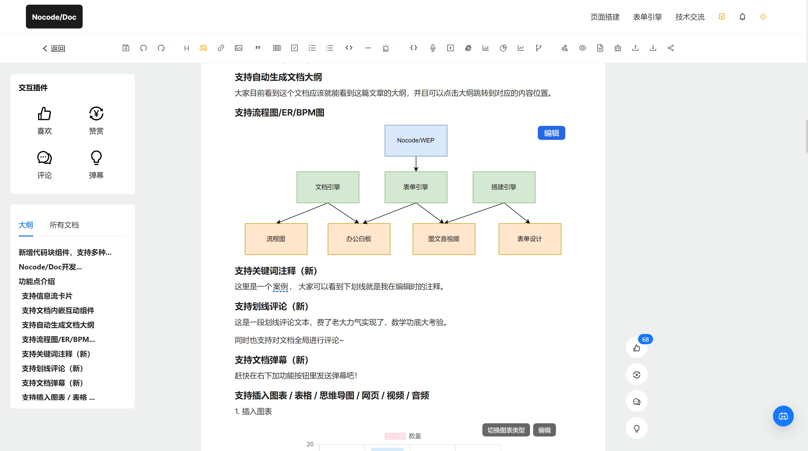

  <a href="http://wep.turntip.cn">
    <h1 align="center">Nocode/WEP文档知识库引擎</h1>
  </a>

Nocode/WEP，一款面向未来的办公可视化平台. 

- 地址: doc.dooring.vip
- 介绍： [能力介绍文档](http://wep.turntip.cn/design/doc?id=d1713369951622&uid=wep_251711700015023)

## 项目已开源拖拽搭建模块

本地启动访问路径：`/dragMode`

next-admin 开源中后台： `https://github.com/MrXujiang/next-admin`

## 特点

- Nocode/Doc 文档搭建引擎
- Nocode/Web web应用搭建引擎
- Nocode/PPT 演示文稿搭建引擎
- Nocode/AI 基于办公场景的AI能力基座

## 规划

- 内容价值传递
- 产品迭代
- 开源
- 技术分享

## 更新记录

- **文档支持配置弹幕**
- **支持文章全局评论**
- **支持图文音视频**
- **支持划线评论**
- **支持自定义画板**
- **支持流程图编辑器**
- **支持表单设计器**
- **支持关键词注释，批注**
- **支持文章数据统计**（访问量，PUV，字数和阅读时间分析）
- **支持文章自定义赞赏配置**
- **支持json导入导出**
- **支持一键复制内容块**
- **支持无限层级目录**

## 浏览器兼容性

支持主流浏览器.

|  Edge |  Firefox |  Chrome |  Safari |  Opera |
| --- | --- | --- | --- | --- |
| Edge | last 2 versions | last 2 versions | last 2 versions | last 2 versions |

## 更多可视化产品

| name                                                                              | Description                                                                             |
| --------------------------------------------------------------------------------- | --------------------------------------------------------------------------------------- |
| [H5-Dooring](https://github.com/MrXujiang/h5-Dooring)                             | 让 H5 制作像搭积木一样简单, 轻松搭建 H5 页面, H5 网站, PC 端网站, LowCode 平台.         |
| [V6.Dooring](https://github.com/MrXujiang/v6.dooring.public)                      | 可视化大屏解决方案, 提供一套可视化编辑引擎, 助力个人或企业轻松定制自己的可视化大屏应用. |
| [橙子试卷](https://turntip.cn) | 一个开箱即用的表单试卷搭建引擎 |
| [dooring-electron-lowcode](https://github.com/MrXujiang/dooring-electron-lowcode) | 基于 electron 的 H5-Dooring 编辑器桌面端.                                               |
| [DooringX](https://github.com/H5-Dooring/dooringx)                                | 快速高效搭建可视化拖拽平台.                                                             |
| [Mitu](https://github.com/H5-Dooring/mitu-editor)                                 | 一款轻量级且可扩展的图片/图形编辑器解决方案.                                            |

## 反馈

如果有好的建议，需求， 欢迎随时和我反馈交流。

## 联系

wechat: `cxzk_168`
